# Platform Control & Revenue Management System - Entity Relationship Diagram (ERD)

## Executive Summary

This Entity Relationship Diagram (ERD) represents a comprehensive **Platform Control & Revenue Management System** designed to handle multi-role e-commerce operations. The system supports four distinct user roles (Admin, Vendor, Logistics, Finance) and manages the complete business lifecycle from product creation to order fulfillment, payment processing, and dispute resolution.

## System Architecture Overview

The system follows a **multi-tenant architecture** where different user roles have access to specialized dashboards and functionalities:

- **Admin Dashboard**: Complete system oversight, revenue analytics, user management, dispute resolution
- **Vendor Portal**: Product management, earnings tracking, subscription handling, order management
- **Logistics Hub**: Order fulfillment, shipping management, tracking coordination, delivery updates
- **Finance Center**: Revenue reporting, payout management, transaction logs, financial analytics

## Complete Database Schema

```mermaid
erDiagram
    %% Core User Management
    USERS {
        uuid id PK
        string email UK
        string password_hash
        string first_name
        string last_name
        string phone
        enum role "admin, vendor, logistics, finance"
        enum status "active, inactive, pending, suspended"
        string avatar_url
        timestamp created_at
        timestamp updated_at
        timestamp last_login
        boolean email_verified
        string verification_token
        string reset_token
        timestamp reset_token_expires
    }

    USER_PROFILES {
        uuid id PK
        uuid user_id FK
        text bio
        string company_name
        string website
        string address_line1
        string address_line2
        string city
        string state
        string postal_code
        string country
        string tax_id
        string business_license
        json metadata
        timestamp created_at
        timestamp updated_at
    }

    %% Product Management
    CATEGORIES {
        uuid id PK
        string name UK
        string slug UK
        text description
        string image_url
        uuid parent_id FK
        integer sort_order
        boolean is_active
        timestamp created_at
        timestamp updated_at
    }

    PRODUCTS {
        uuid id PK
        uuid vendor_id FK
        uuid category_id FK
        string name
        string slug UK
        text description
        text short_description
        decimal price
        decimal compare_price
        string sku UK
        integer stock_quantity
        integer min_stock_level
        enum status "draft, pending, approved, rejected, active, inactive"
        enum visibility "public, private, unlisted"
        json images
        json specifications
        json variants
        decimal weight
        decimal length
        decimal width
        decimal height
        boolean is_digital
        boolean requires_shipping
        json seo_meta
        timestamp created_at
        timestamp updated_at
        timestamp published_at
    }

    PRODUCT_REVIEWS {
        uuid id PK
        uuid product_id FK
        uuid user_id FK
        integer rating
        text title
        text content
        json images
        boolean is_verified_purchase
        enum status "pending, approved, rejected"
        timestamp created_at
        timestamp updated_at
    }

    %% Order Management
    ORDERS {
        uuid id PK
        string order_number UK
        uuid customer_id FK
        uuid vendor_id FK
        enum status "pending, confirmed, processing, shipped, delivered, cancelled, refunded"
        enum payment_status "pending, paid, failed, refunded, partially_refunded"
        decimal subtotal
        decimal tax_amount
        decimal shipping_amount
        decimal discount_amount
        decimal total_amount
        string currency
        json shipping_address
        json billing_address
        text notes
        timestamp created_at
        timestamp updated_at
        timestamp shipped_at
        timestamp delivered_at
    }

    ORDER_ITEMS {
        uuid id PK
        uuid order_id FK
        uuid product_id FK
        string product_name
        string product_sku
        decimal unit_price
        integer quantity
        decimal total_price
        json product_snapshot
        timestamp created_at
    }

    %% Payment Management
    PAYMENTS {
        uuid id PK
        uuid order_id FK
        string stripe_payment_intent_id UK
        decimal amount
        string currency
        enum status "pending, succeeded, failed, cancelled, refunded"
        enum payment_method "card, bank_transfer, wallet, crypto"
        string payment_method_details
        json metadata
        timestamp created_at
        timestamp updated_at
        timestamp processed_at
    }

    PAYOUTS {
        uuid id PK
        uuid vendor_id FK
        string stripe_transfer_id UK
        decimal amount
        string currency
        enum status "pending, processing, completed, failed, cancelled"
        enum payout_method "bank_account, debit_card"
        string destination_account
        json metadata
        text failure_reason
        timestamp created_at
        timestamp updated_at
        timestamp processed_at
    }

    TRANSACTIONS {
        uuid id PK
        uuid user_id FK
        uuid order_id FK
        uuid payment_id FK
        enum type "payment, payout, refund, fee, commission"
        decimal amount
        string currency
        enum status "pending, completed, failed, cancelled"
        text description
        json metadata
        timestamp created_at
        timestamp updated_at
    }

    %% Logistics Management
    SHIPPING_METHODS {
        uuid id PK
        string name
        string carrier
        string service_type
        decimal base_rate
        decimal per_kg_rate
        decimal per_item_rate
        integer estimated_days_min
        integer estimated_days_max
        boolean is_active
        json coverage_areas
        timestamp created_at
        timestamp updated_at
    }

    SHIPMENTS {
        uuid id PK
        uuid order_id FK
        uuid shipping_method_id FK
        string tracking_number UK
        enum status "pending, picked_up, in_transit, out_for_delivery, delivered, failed, returned"
        decimal weight
        json dimensions
        string carrier
        string service_type
        json tracking_events
        timestamp created_at
        timestamp updated_at
        timestamp shipped_at
        timestamp delivered_at
    }

    SHIPPING_ADDRESSES {
        uuid id PK
        uuid user_id FK
        string name
        string company
        string address_line1
        string address_line2
        string city
        string state
        string postal_code
        string country
        string phone
        boolean is_default
        timestamp created_at
        timestamp updated_at
    }

    %% Subscription Management
    SUBSCRIPTION_PLANS {
        uuid id PK
        string name
        string slug UK
        text description
        decimal monthly_price
        decimal yearly_price
        integer max_products
        integer max_orders_per_month
        decimal commission_rate
        json features
        boolean is_active
        timestamp created_at
        timestamp updated_at
    }

    SUBSCRIPTIONS {
        uuid id PK
        uuid vendor_id FK
        uuid plan_id FK
        enum status "active, cancelled, expired, suspended"
        enum billing_cycle "monthly, yearly"
        decimal amount
        string currency
        timestamp start_date
        timestamp end_date
        timestamp next_billing_date
        timestamp cancelled_at
        json metadata
        timestamp created_at
        timestamp updated_at
    }

    %% Dispute Management
    DISPUTES {
        uuid id PK
        uuid order_id FK
        uuid customer_id FK
        uuid vendor_id FK
        enum type "refund, quality_issue, shipping_issue, fraud, other"
        enum status "open, in_review, resolved, closed"
        enum priority "low, medium, high, urgent"
        text description
        text resolution_notes
        decimal requested_refund_amount
        decimal approved_refund_amount
        uuid assigned_to FK
        timestamp created_at
        timestamp updated_at
        timestamp resolved_at
    }

    DISPUTE_MESSAGES {
        uuid id PK
        uuid dispute_id FK
        uuid user_id FK
        text message
        json attachments
        boolean is_internal
        timestamp created_at
    }

    %% Analytics & Reporting
    ANALYTICS_EVENTS {
        uuid id PK
        uuid user_id FK
        string event_type
        string event_name
        json properties
        string session_id
        string ip_address
        string user_agent
        timestamp created_at
    }

    REPORTS {
        uuid id PK
        uuid user_id FK
        string name
        enum type "revenue, orders, products, users, logistics"
        json filters
        json data
        enum status "generating, completed, failed"
        timestamp created_at
        timestamp updated_at
        timestamp generated_at
    }

    %% Notification System
    NOTIFICATIONS {
        uuid id PK
        uuid user_id FK
        string title
        text message
        enum type "info, warning, error, success"
        enum channel "email, sms, push, in_app"
        enum status "pending, sent, delivered, failed"
        json metadata
        timestamp created_at
        timestamp sent_at
        timestamp read_at
    }

    %% Settings & Configuration
    PLATFORM_SETTINGS {
        uuid id PK
        string key UK
        json value
        text description
        enum type "string, number, boolean, json"
        timestamp created_at
        timestamp updated_at
    }

    %% Relationships
    USERS ||--o{ USER_PROFILES : "has profile"
    USERS ||--o{ PRODUCTS : "vendor creates"
    USERS ||--o{ ORDERS : "customer places"
    USERS ||--o{ ORDERS : "vendor receives"
    USERS ||--o{ PAYOUTS : "vendor receives"
    USERS ||--o{ TRANSACTIONS : "user involved"
    USERS ||--o{ SUBSCRIPTIONS : "vendor subscribes"
    USERS ||--o{ DISPUTES : "customer creates"
    USERS ||--o{ DISPUTES : "vendor involved"
    USERS ||--o{ DISPUTES : "admin assigned"
    USERS ||--o{ DISPUTE_MESSAGES : "user sends"
    USERS ||--o{ SHIPPING_ADDRESSES : "user has"
    USERS ||--o{ ANALYTICS_EVENTS : "user generates"
    USERS ||--o{ REPORTS : "user creates"
    USERS ||--o{ NOTIFICATIONS : "user receives"

    CATEGORIES ||--o{ CATEGORIES : "parent-child"
    CATEGORIES ||--o{ PRODUCTS : "categorizes"

    PRODUCTS ||--o{ PRODUCT_REVIEWS : "has reviews"
    PRODUCTS ||--o{ ORDER_ITEMS : "included in orders"

    ORDERS ||--o{ ORDER_ITEMS : "contains items"
    ORDERS ||--o{ PAYMENTS : "has payments"
    ORDERS ||--o{ SHIPMENTS : "has shipments"
    ORDERS ||--o{ DISPUTES : "can have disputes"

    PAYMENTS ||--o{ TRANSACTIONS : "generates transaction"

    SHIPPING_METHODS ||--o{ SHIPMENTS : "used for shipping"

    SUBSCRIPTION_PLANS ||--o{ SUBSCRIPTIONS : "plan type"

    DISPUTES ||--o{ DISPUTE_MESSAGES : "has messages"
```

## Detailed Entity Analysis

### 1. **User Management System**

#### USERS Entity
**Purpose**: Central authentication and authorization system for all platform users.

**Key Attributes**:
- `id` (UUID, Primary Key): Globally unique identifier for each user
- `email` (String, Unique): Primary login credential and communication channel
- `role` (Enum): Defines user permissions and dashboard access
  - `admin`: Full system access, user management, dispute resolution
  - `vendor`: Product management, order processing, earnings tracking
  - `logistics`: Shipping management, delivery tracking, inventory updates
  - `finance`: Payment processing, payout management, financial reporting
- `status` (Enum): Account state management
  - `active`: Full platform access
  - `inactive`: Temporarily disabled
  - `pending`: Awaiting approval/verification
  - `suspended`: Temporarily banned due to policy violations

**Business Logic**: The role-based access control (RBAC) system ensures users only access features relevant to their responsibilities, maintaining security and operational efficiency.

#### USER_PROFILES Entity
**Purpose**: Extended user information for business operations and compliance.

**Key Features**:
- **Business Information**: Company details, tax IDs, business licenses for vendor verification
- **Address Management**: Multiple addresses for shipping and billing
- **Metadata Storage**: Flexible JSON field for custom business requirements
- **Compliance Support**: Tax ID and business license storage for regulatory compliance

**Relationship**: One-to-One with USERS (each user has exactly one profile)

### 2. **Product Management System**

#### CATEGORIES Entity
**Purpose**: Hierarchical product organization system.

**Key Features**:
- **Self-Referencing Relationship**: Categories can have parent-child relationships (e.g., Electronics > Smartphones > iPhone)
- **SEO Optimization**: Slug field for URL-friendly category names
- **Sort Order**: Customizable category ordering for better user experience
- **Image Support**: Category-specific imagery for visual navigation

**Business Logic**: Hierarchical structure allows for flexible product organization and improved search/filtering capabilities.

#### PRODUCTS Entity
**Purpose**: Core product catalog with comprehensive product information.

**Key Attributes**:
- **Pricing**: `price` (selling price), `compare_price` (original price for discounts)
- **Inventory**: `stock_quantity`, `min_stock_level` for automated reorder alerts
- **Status Workflow**: `draft` → `pending` → `approved/rejected` → `active/inactive`
- **Digital Products**: `is_digital` flag for software, e-books, etc.
- **Shipping Requirements**: `requires_shipping` for service-based products
- **Variants**: JSON field for product variations (size, color, etc.)
- **SEO**: Dedicated SEO metadata for search engine optimization

**Business Logic**: The approval workflow ensures product quality control, while the variant system supports complex product offerings.

#### PRODUCT_REVIEWS Entity
**Purpose**: Customer feedback system with moderation capabilities.

**Key Features**:
- **Rating System**: 1-5 star rating system
- **Verification**: `is_verified_purchase` ensures authentic reviews
- **Moderation**: Admin approval system prevents spam and inappropriate content
- **Media Support**: Image attachments for detailed feedback

### 3. **Order Management System**

#### ORDERS Entity
**Purpose**: Central order tracking with complete lifecycle management.

**Key Attributes**:
- **Order Number**: Human-readable unique identifier for customer reference
- **Dual User Relationship**: Links to both customer (buyer) and vendor (seller)
- **Status Tracking**: Comprehensive order lifecycle from pending to delivered
- **Financial Breakdown**: Detailed cost structure (subtotal, tax, shipping, discounts)
- **Address Management**: Separate shipping and billing addresses
- **Currency Support**: Multi-currency support for international operations

**Business Logic**: The dual relationship (customer-vendor) enables the marketplace model where multiple vendors can sell through the platform.

#### ORDER_ITEMS Entity
**Purpose**: Individual product line items within orders.

**Key Features**:
- **Product Snapshot**: JSON field preserves product details at time of purchase
- **Price Preservation**: Unit price captured to handle price changes over time
- **Quantity Tracking**: Individual item quantities for inventory management

**Business Logic**: Product snapshots ensure order integrity even if original products are modified or deleted.

### 4. **Payment System**

#### PAYMENTS Entity
**Purpose**: Payment processing with Stripe integration.

**Key Features**:
- **Stripe Integration**: `stripe_payment_intent_id` for seamless payment processing
- **Multiple Payment Methods**: Card, bank transfer, digital wallet, cryptocurrency
- **Status Tracking**: Complete payment lifecycle from pending to completed
- **Metadata Storage**: Additional payment information and processing details

#### PAYOUTS Entity
**Purpose**: Vendor earnings distribution system.

**Key Features**:
- **Stripe Transfers**: Direct integration with Stripe for automated payouts
- **Multiple Payout Methods**: Bank account or debit card transfers
- **Status Tracking**: Payout processing from pending to completed
- **Failure Handling**: Detailed failure reasons for troubleshooting

#### TRANSACTIONS Entity
**Purpose**: Comprehensive financial transaction log.

**Key Features**:
- **Transaction Types**: Payments, payouts, refunds, fees, commissions
- **Audit Trail**: Complete financial history for compliance and reporting
- **Multi-Entity Linking**: Links to users, orders, and payments for complete traceability

### 5. **Logistics Management System**

#### SHIPPING_METHODS Entity
**Purpose**: Configurable shipping options and rates.

**Key Features**:
- **Rate Calculation**: Base rate + per-kg + per-item pricing models
- **Carrier Integration**: Support for multiple shipping carriers (FedEx, UPS, etc.)
- **Delivery Estimates**: Minimum and maximum delivery timeframes
- **Coverage Areas**: Geographic restrictions and availability

#### SHIPMENTS Entity
**Purpose**: Individual shipment tracking and management.

**Key Features**:
- **Tracking Integration**: Carrier tracking number and status updates
- **Event History**: JSON field storing all tracking events
- **Status Progression**: From pending to delivered with failure handling
- **Physical Attributes**: Weight and dimensions for shipping calculations

#### SHIPPING_ADDRESSES Entity
**Purpose**: User address book for shipping destinations.

**Key Features**:
- **Multiple Addresses**: Users can store multiple shipping addresses
- **Default Address**: Primary address designation for quick checkout
- **Address Validation**: Structured address format for shipping accuracy

### 6. **Subscription Management System**

#### SUBSCRIPTION_PLANS Entity
**Purpose**: Flexible vendor subscription tiers.

**Key Features**:
- **Feature-Based Access**: JSON field defining plan capabilities
- **Usage Limits**: Maximum products and orders per month
- **Commission Structure**: Platform commission rates per plan
- **Billing Options**: Monthly and yearly pricing options

#### SUBSCRIPTIONS Entity
**Purpose**: Active vendor subscriptions and billing management.

**Key Features**:
- **Billing Cycle Management**: Monthly or yearly billing
- **Status Tracking**: Active, cancelled, expired, suspended states
- **Renewal Management**: Next billing date and automatic renewal
- **Cancellation Handling**: Graceful subscription termination

### 7. **Dispute Resolution System**

#### DISPUTES Entity
**Purpose**: Multi-party dispute management system.

**Key Features**:
- **Dispute Types**: Refund, quality issues, shipping problems, fraud, other
- **Priority Levels**: Low, medium, high, urgent for response time management
- **Multi-Party Involvement**: Customer, vendor, and admin assignment
- **Resolution Tracking**: From open to resolved with detailed notes
- **Financial Impact**: Requested and approved refund amounts

#### DISPUTE_MESSAGES Entity
**Purpose**: Communication thread for dispute resolution.

**Key Features**:
- **Message Threading**: Organized conversation flow
- **Attachment Support**: Document and image sharing
- **Internal Notes**: Admin-only messages for internal coordination
- **Audit Trail**: Complete communication history

### 8. **Analytics & Reporting System**

#### ANALYTICS_EVENTS Entity
**Purpose**: Comprehensive user behavior and system event tracking.

**Key Features**:
- **Event Types**: Page views, clicks, purchases, errors, etc.
- **Session Tracking**: User session identification
- **Property Storage**: Flexible JSON field for event-specific data
- **Privacy Compliance**: IP address and user agent for analytics

#### REPORTS Entity
**Purpose**: Custom report generation and storage.

**Key Features**:
- **Report Types**: Revenue, orders, products, users, logistics
- **Filter System**: JSON-based filtering for custom report criteria
- **Status Tracking**: Report generation progress and completion
- **Data Storage**: Generated report data for quick access

### 9. **Notification System**

#### NOTIFICATIONS Entity
**Purpose**: Multi-channel communication system.

**Key Features**:
- **Channel Support**: Email, SMS, push notifications, in-app messages
- **Delivery Tracking**: Status from pending to delivered
- **Read Status**: User acknowledgment tracking
- **Metadata Storage**: Additional notification context and settings

### 10. **Platform Configuration**

#### PLATFORM_SETTINGS Entity
**Purpose**: Flexible system configuration management.

**Key Features**:
- **Key-Value Storage**: Flexible configuration system
- **Type Safety**: String, number, boolean, JSON data types
- **Environment Support**: Different settings for development, staging, production
- **Documentation**: Built-in setting descriptions

## Relationship Analysis

### One-to-One Relationships
- **USERS ↔ USER_PROFILES**: Each user has exactly one profile
- **ORDERS ↔ PAYMENTS**: Each order has one primary payment (simplified model)

### One-to-Many Relationships
- **USERS → PRODUCTS**: One vendor can create many products
- **USERS → ORDERS**: One customer can place many orders
- **PRODUCTS → ORDER_ITEMS**: One product can be in many order items
- **ORDERS → ORDER_ITEMS**: One order contains many items
- **CATEGORIES → PRODUCTS**: One category contains many products
- **CATEGORIES → CATEGORIES**: Self-referencing for hierarchical structure

### Many-to-Many Relationships (Implemented through Junction Tables)
- **USERS ↔ SUBSCRIPTION_PLANS**: Through SUBSCRIPTIONS table
- **ORDERS ↔ SHIPPING_METHODS**: Through SHIPMENTS table

## Business Process Flows

### 1. **Product Creation Workflow**
1. Vendor creates product (status: draft)
2. Product submitted for review (status: pending)
3. Admin reviews and approves/rejects (status: approved/rejected)
4. Approved products go live (status: active)

### 2. **Order Processing Workflow**
1. Customer places order (status: pending)
2. Payment processed (payment_status: paid)
3. Order confirmed (status: confirmed)
4. Vendor processes order (status: processing)
5. Shipment created and tracked (status: shipped)
6. Delivery completed (status: delivered)

### 3. **Payment and Payout Workflow**
1. Customer payment processed through Stripe
2. Payment recorded in PAYMENTS table
3. Transaction logged in TRANSACTIONS table
4. Vendor earnings calculated and scheduled for payout
5. Payout processed through Stripe transfers
6. Payout status updated and transaction logged

### 4. **Dispute Resolution Workflow**
1. Customer creates dispute
2. Dispute assigned to admin
3. Admin reviews and communicates with parties
4. Resolution determined and implemented
5. Dispute closed with resolution notes

## Technical Implementation Considerations

### Database Design Principles
1. **Normalization**: Third normal form to eliminate redundancy
2. **Referential Integrity**: Foreign key constraints ensure data consistency
3. **Indexing Strategy**: Optimized indexes for frequently queried fields
4. **Data Types**: Appropriate data types for performance and storage efficiency

### Security Considerations
1. **Data Encryption**: Sensitive data encrypted at rest and in transit
2. **Access Control**: Role-based permissions at database level
3. **Audit Trails**: Complete change tracking for compliance
4. **Data Privacy**: GDPR compliance with data retention policies

### Performance Optimization
1. **Query Optimization**: Efficient queries with proper indexing
2. **Connection Pooling**: Database connection management
3. **Caching Strategy**: Redis integration for frequently accessed data
4. **Partitioning**: Large tables partitioned by date for better performance

### Scalability Features
1. **Horizontal Scaling**: Read replicas for query distribution
2. **Microservices Ready**: Modular design for service separation
3. **API Integration**: RESTful API design for external integrations
4. **Event-Driven Architecture**: Asynchronous processing for heavy operations

## Advanced Database Considerations

### Indexing Strategy
1. **Primary Indexes**: All primary keys automatically indexed
2. **Unique Indexes**: Email, order_number, tracking_number, SKU fields
3. **Composite Indexes**: 
   - `(user_id, status)` for user-specific queries
   - `(vendor_id, created_at)` for vendor performance analytics
   - `(order_id, status)` for order tracking
4. **Partial Indexes**: Active products, pending orders for performance
5. **Full-Text Indexes**: Product names, descriptions for search functionality

### Data Integrity Constraints
1. **Foreign Key Constraints**: All relationships enforced at database level
2. **Check Constraints**: 
   - Rating values (1-5 for reviews)
   - Positive amounts for payments and prices
   - Valid email format validation
   - Status enum validation
3. **Unique Constraints**: Prevent duplicate data entry
4. **Not Null Constraints**: Ensure required fields are populated

### Audit and Compliance Features
1. **Audit Triggers**: Automatic logging of all data changes
2. **Soft Deletes**: Mark records as deleted without physical removal
3. **Data Retention Policies**: Automatic archival of old data
4. **GDPR Compliance**: Right to be forgotten implementation
5. **SOX Compliance**: Financial data integrity and audit trails

### Performance Optimization
1. **Connection Pooling**: PgBouncer for PostgreSQL connection management
2. **Query Optimization**: 
   - Prepared statements for frequently used queries
   - Query plan analysis and optimization
   - Proper use of EXPLAIN ANALYZE
3. **Caching Layers**:
   - Redis for session management
   - Application-level caching for frequently accessed data
   - CDN for static assets and images
4. **Database Partitioning**:
   - Analytics events by date (monthly partitions)
   - Transaction logs by date
   - Large tables split for better performance

### Backup and Recovery Strategy
1. **Automated Backups**: Daily full backups with point-in-time recovery
2. **Replication**: Master-slave setup for high availability
3. **Disaster Recovery**: Cross-region backup storage
4. **Testing**: Regular backup restoration testing
5. **Monitoring**: Database health monitoring and alerting

## Integration Points and External Systems

### Payment Gateway Integration (Stripe)
- **Webhook Handling**: Real-time payment status updates
- **Idempotency**: Prevent duplicate payment processing
- **Error Handling**: Graceful failure handling and retry logic
- **PCI Compliance**: Secure handling of payment data

### Shipping Carrier APIs (FedEx, UPS)
- **Rate Calculation**: Real-time shipping cost calculation
- **Label Generation**: Automated shipping label creation
- **Tracking Integration**: Real-time package tracking updates
- **Address Validation**: Shipping address verification

### Email Service Integration (Resend)
- **Transactional Emails**: Order confirmations, shipping notifications
- **Marketing Emails**: Promotional campaigns, newsletters
- **Template Management**: Dynamic email template system
- **Delivery Tracking**: Email delivery status monitoring

### Analytics Integration (Google Analytics)
- **Event Tracking**: Custom event tracking for business metrics
- **E-commerce Tracking**: Enhanced e-commerce data collection
- **User Behavior**: Detailed user journey analysis
- **Conversion Tracking**: Sales funnel analysis

## Security Implementation

### Authentication and Authorization
1. **Multi-Factor Authentication**: Optional 2FA for enhanced security
2. **Role-Based Access Control**: Granular permissions per user role
3. **Session Management**: Secure session handling with expiration
4. **Password Security**: Bcrypt hashing with salt rounds
5. **API Security**: JWT tokens with expiration and refresh mechanisms

### Data Protection
1. **Encryption at Rest**: AES-256 encryption for sensitive data
2. **Encryption in Transit**: TLS 1.3 for all data transmission
3. **PII Protection**: Special handling for personally identifiable information
4. **Payment Data**: PCI DSS compliance for payment information
5. **Data Masking**: Sensitive data masking in non-production environments

### Network Security
1. **Firewall Configuration**: Proper network segmentation
2. **DDoS Protection**: CloudFlare or similar DDoS mitigation
3. **Rate Limiting**: API rate limiting to prevent abuse
4. **CORS Configuration**: Proper cross-origin resource sharing setup
5. **Security Headers**: Comprehensive security headers implementation

## Monitoring and Alerting

### Application Monitoring
1. **Error Tracking**: Sentry or similar error monitoring
2. **Performance Monitoring**: APM tools for application performance
3. **Uptime Monitoring**: Service availability monitoring
4. **Log Aggregation**: Centralized logging with ELK stack
5. **Custom Metrics**: Business-specific metrics tracking

### Database Monitoring
1. **Query Performance**: Slow query identification and optimization
2. **Connection Monitoring**: Database connection pool monitoring
3. **Storage Monitoring**: Disk space and growth monitoring
4. **Replication Lag**: Master-slave replication monitoring
5. **Backup Verification**: Automated backup integrity checking

## Deployment and DevOps

### Environment Management
1. **Development Environment**: Local development setup
2. **Staging Environment**: Production-like testing environment
3. **Production Environment**: High-availability production setup
4. **Environment Variables**: Secure configuration management
5. **Secrets Management**: Secure handling of API keys and passwords

### CI/CD Pipeline
1. **Automated Testing**: Unit, integration, and end-to-end tests
2. **Code Quality**: Static analysis and code review processes
3. **Database Migrations**: Automated database schema updates
4. **Deployment Automation**: Zero-downtime deployment strategies
5. **Rollback Procedures**: Quick rollback capabilities for failed deployments

## Conclusion

This comprehensive ERD provides a robust foundation for a modern Platform Control & Revenue Management System. The design supports:

- **Scalability**: Horizontal scaling capabilities for growth
- **Security**: Enterprise-grade security and compliance features
- **Performance**: Optimized for high-performance operations
- **Maintainability**: Clean, normalized design for easy maintenance
- **Flexibility**: Extensible design for future feature additions
- **Integration**: Ready for third-party service integrations

The system is designed to handle the complexities of a multi-role marketplace while maintaining data integrity, security, and performance. Each entity and relationship has been carefully considered to support the business requirements while following database design best practices.

This ERD serves as the blueprint for implementing a production-ready platform that can scale from startup to enterprise-level operations, supporting thousands of vendors, millions of products, and high-volume transaction processing.
